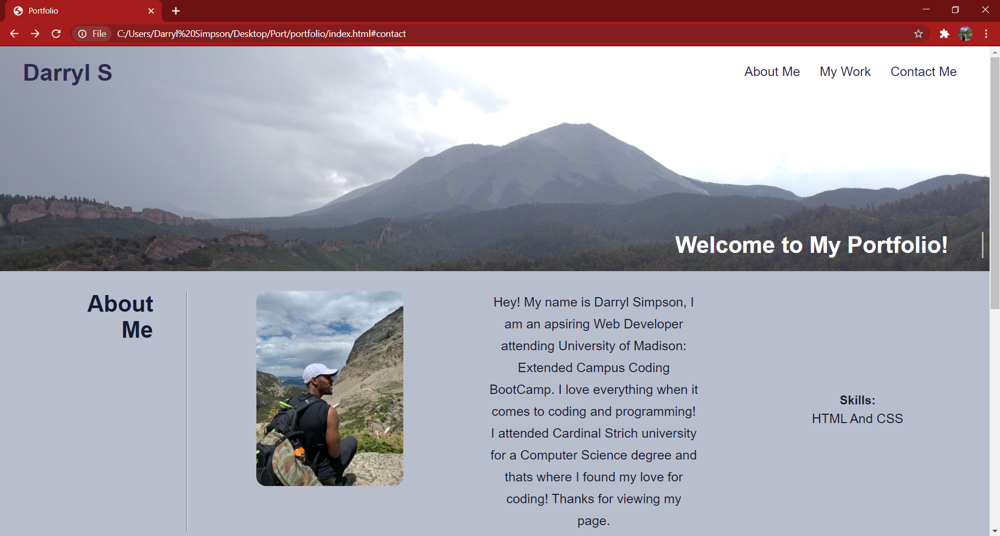
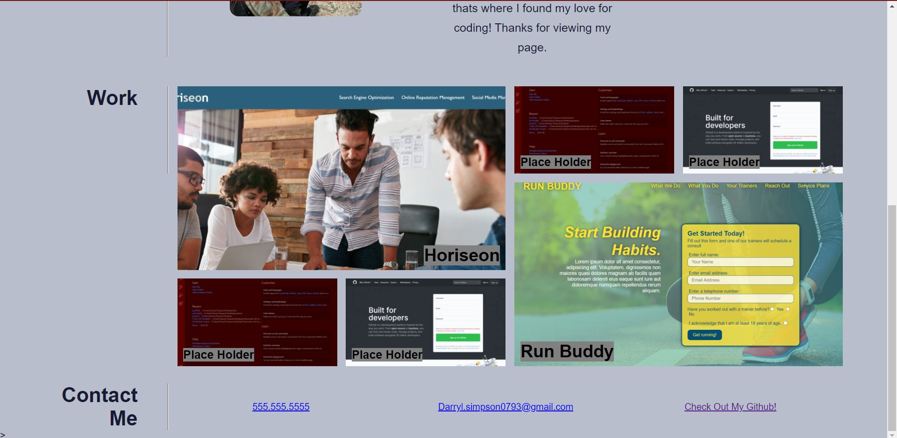

# My First Portfolio

## This is my first attempt at making a Web Portfolio.

* WHEN you load my page 
* THEN you are presented with my name a recent photo and links to sections about me, my work and how to contact me.
* WHEN you click one of those links
* THEN you are directed to the propper section on my page 
* WHEN youre at the "My Work" section
* THEN you will see that there are titles on the images and if you click on them they will take you to the corrospinding page that they're intended to
* WHEN you resize your page or view it on various devices
* THEN you will have a responsive layout that adapts to your viewport
* WHEN looking at the source code
* THEN you will be presented with Consolidated and neat HTML and CSS 

## Code Used
* I used a combination of HTML and CSS for this page, taking advantage of flexbox and grid to arrange my page the way I felt was neccesary

## Images of Page

[Link to page](https://darrylsimpson.github.io/DarrylS-Portfolio)

This was created by Darryl Simpson 
Feel free to contact me at [Darryl.Simpson0793@gmail.com](mailto:Darryl.Simpson0793@gmail.com)